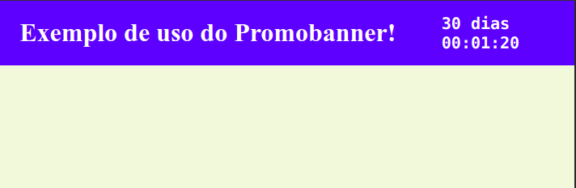

# Promobanner

Projeto inspirado no [Swiper.js](https://swiperjs.com/), que isola o comportamento de um contador regressivo.



## Instalação

Para obter a release mais recente do projeto, você pode buildar o script de promobanner do código fonte. Com o seguinte passo a passo:

- Clone este repositório
- Instale as dependências com seu gerenciador de pacotes preferido HT(exemplo: `npm i`)
- Execute o script de build deste projeto. (exemplo: `npm run build`)

O script irá se encontrar em `doc/promobanner-v<versão-do-projeto>.js`

## Uso

Inclua este script na sua página. Isso pode ser feito diretamente no HTML:

```
<script src="/path/to/promobanner-v<versão-do-projeto>.js"></script>
```

Na sua página, você deverá estabelecer classes para o container do banner e o container do contador. O script irá sobrescrever tudo que estiver dentro do elemento do contador periodicamente.

Por fim, você deverá instanciar a classe `Promobanner`. Por exemplo, numa tag `script` ao final do `body` da sua página.

O construtor aceita um objeto com diversos campos. São estes:

- **locale**: a linguagem a ser usada pela aplicação. *(default: pt-br)*
- **blacklistPaths**: paths nos quais o banner não deverá ser exibido. Aceita um array de strings.
- **hideWhen**: função que define se o banner deverá ser exibido. Aceita uma função sem parâmetros que deve retornar um booleano.
- **countdownFormatter**: função que define o formato exibido do valor do contador. Aceita uma função cujo parâmetro é um objeto **Duration** do [luxon](https://moment.github.io/luxon/api-docs/index.html#duration) e retorna uma string que será inserida no elemento de countdown.
- **bannerDisplayInterval**: intervalo dentro do qual o banner deve ser exibido. Aceita um objeto com dois valores, ambos do tipo [Date](https://developer.mozilla.org/pt-BR/docs/Web/JavaScript/Reference/Global_Objects/Date): init (para a data a partir da qual o banner deverá ser exibido) e end (data limite para a qual o banner deverá ser exibido).
- **timerDisplayInterval**: intervalo dentro do qual o contador deve ser exibido. Aceita um objeto com dois valores, ambos do tipo [Date](https://developer.mozilla.org/pt-BR/docs/Web/JavaScript/Reference/Global_Objects/Date): 
     - init: para a data a partir da qual o contador deverá ser exibido.
     - end: data limite para a qual o contador deverá ser exibido.
- **cssClasses**: classes usadas para os elementos envolvidos no banner de contagem. No momento, são eles:
    - container: classe do banner onde o contador estará. *(default: promobanner-container)*
    - counter: classe do contador. *(default: promobanner-counter)*

### EXEMPLO

```
    <script defer>
      const promoBanner = new Promobanner({
        timerDisplayInterval: {
          init: new Date(),
          end: new Date("2024-12-05 22:00:00"),
        },
        countdownFormatter: (interval) => {
          let daysRepresentation = "";

          if (interval.days) {
            daysRepresentation = interval
              .shiftTo("days")
              .mapUnits((x) => Math.floor(x))
              .toHuman();
          }

          const timeRepresentation = interval
            .set({ days: 0 })
            .toFormat("hh:mm:ss");

          return `${daysRepresentation} ${timeRepresentation}`;
        },
      });
    </script>
```